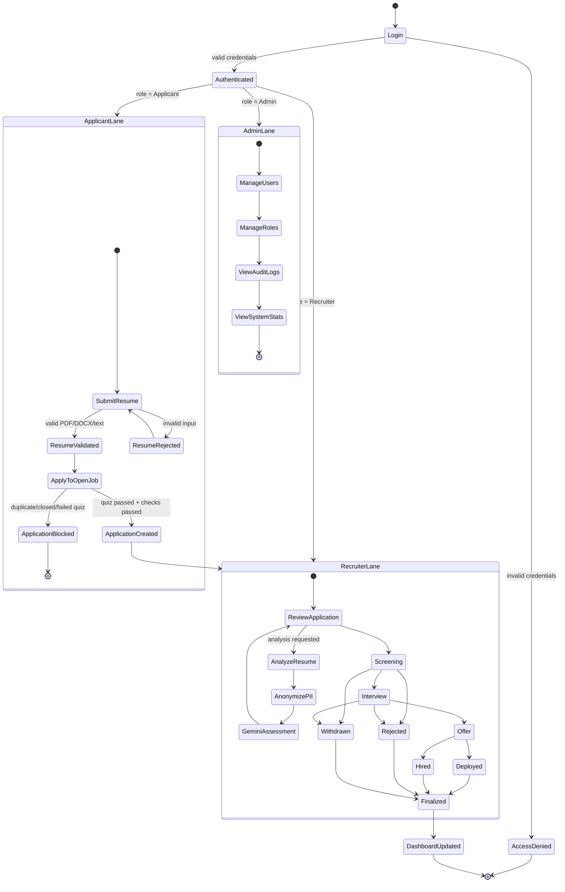
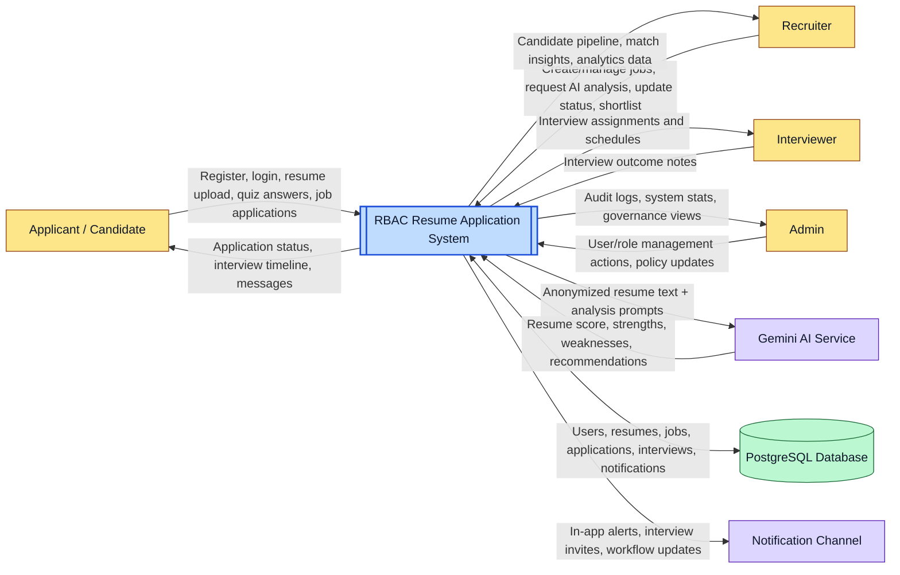
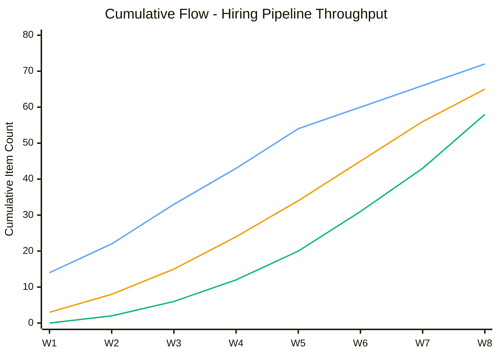

# System Diagrams - RBAC Resume Application

Reference basis: `backend/main.py`, `backend/routes/resume_routes.py`, `backend/models/controllers/resume_controller.py`, `backend/routes/application_routes.py`, `backend/models/application.py`, `frontend/src/pages/RecruiterDashboard.jsx`.

---

## 1) Process Visualization - End-to-End Application Processing (Non-Flowchart)

Legend:
- Applicant lane: resume/application intake and validation
- Recruiter lane: analysis, pipeline progression, and outcome handling
- Admin lane: user/role control, audit logs, and system stats
- `AnalyzeResume -> AnonymizePII -> GeminiAssessment`: AI evaluation sequence
- `Finalized`: terminal business outcomes (`hired`, `deployed`, `rejected`, `withdrawn`)

Annotation:
- This keeps the workflow as a visual process map without using the traditional flowchart symbol style.

---

## 2) Context Flow Diagram (CFD) - System in Its Environment

Legend:
- Yellow: human external entities
- Blue: target system boundary/core process
- Purple: external services/channels
- Green cylinder: database/data store
- Arrows: data flow direction (input/output)

Annotation:
- Data to Gemini is anonymized before analysis, while complete system records remain in PostgreSQL.

---

## 3) Cumulative Flow Diagram (CFD) - Workflow Progress Over Time

Legend:
- Blue line (`To Do`): applications entering queue (mapped from early-stage intake like `received`)
- Orange line (`In Progress`): active processing (`screening`, `interview`, `offer`)
- Green line (`Completed`): final outcomes (`hired`, `rejected`, `withdrawn`, `deployed`)

Annotation:
- If the gap between `To Do` and `In Progress` widens quickly, intake is outpacing active processing.
- If `In Progress` grows faster than `Completed`, a downstream bottleneck likely exists.
- Replace weekly values with live counts from your analytics endpoints for production reporting.
